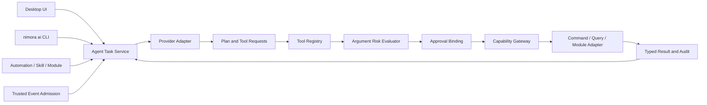

# Nimora AI Agent 与 CLI 架构规范

> 版本：0.1.0-draft  
> 更新日期：2026-07-18
> 状态：实现基线

## 1. 产品边界

AI 是 Nimora 的可选增强运行时，不是桌宠、自动化、用户代码或本地数据的启动依赖。桌面 UI、`nimora ai` CLI、Automation、Skill 和其它宿主模块共享同一个 Agent Runtime；任何入口都不得建立绕过权限、风险确认或审计的第二条执行路径。

Agent 能力包括对话、计划、工具调用、任务暂停/继续/取消、历史、Provider 切换、Agent Pack、受控记忆和保存为自动化。没有网络、账户、API Key 或可用 Provider 时，非 AI 能力继续工作并返回稳定降级状态。

### 1.1 Codex 与 Claude Code 级交互基线

Nimora 借鉴 Coding Agent 的优秀交互，但不复制其宿主权限模型。必须提供：持久 Goal、显式 Plan、Auto Mode、Checkpoint/Resume、工作区上下文压缩、工具调用回执、可审计计划变更、后台任务、多 Agent 编排和机器可读 CLI。Goal 表示跨会话最终目标，不等同于单次 Prompt；Plan 是可修改的执行视图，不得被当作完成证明；Checkpoint 保存任务、预算、Provider continuation、工具结果摘要和资源版本，不保存 Approval、原生句柄或可重放的批准证明。

Auto Mode 不是“跳过确认”。它只允许 Agent 在 Goal、调用方 Capability、Tool allowlist、数据策略、费用、墙钟、步骤和并发预算的交集内持续推进。Safe 只读步骤可自动运行；写入、外部副作用、数据出境、凭据访问、安装执行代码和 Medium 以上风险仍按策略逐项确认或绑定已批准不可变计划。预算耗尽、目标冲突、上下文不确定、工作区版本变化、Provider 降级或不可补偿副作用必须暂停并给出结构化原因。

当前实现已具备任务状态机、Provider/Tool 单步、参数绑定批准、预算、取消、历史、CLI JSON 契约和受控模块调用基础。`agent-runtime` 已实现独立 Goal/Plan 领域契约：Goal 生命周期与可修订 Plan 分离，Plan 修订保持单调，完成状态要求当前 Plan 每一步均有证据；SQLite 使用 Goal 当前状态表与不可变 Plan 修订表事务持久化，并拒绝陈旧写入和索引元数据/Payload 不一致。CLI 已提供 `goal create|list|show`、`goal plan replace` 与 `goal status set` 的稳定 JSON 接口，可跨进程恢复。Auto Mode 已实现有界 Policy、Goal/Plan/Workspace 精确绑定、逐步准入决策、预算累积、结构化暂停原因、SQLite 乐观并发仓储、重启强制暂停，以及 `goal auto start|status|pause|resume|cancel` 机器可读控制面。宿主无关的 `AutoModeTurnSupervisor` 已接入现有 `AgentCoordinator`：每轮先准入 Provider 步骤，再对整批 Tool 做零副作用预检；只有全部调用均为获准安全只读时，才通过原 Tool Registry 与 Backend 执行并生成严格关联 continuation。版本化 `AutoModeCheckpoint` 与 SQLite CAS 仓储已实现有界 Provider continuation、Task/Goal/Plan/Workspace/Policy 精确绑定、序号单调和索引元数据复验，不保存批准或宿主对象。结构化 Context Compactor 已实现 Goal/约束/待办/证据/Workspace/Plan Anchor、可信系统消息强制保留、Tool Call/Result 原子单元、源摘要和预算不足 fail-closed；内容寻址内存 Cache 已实现 Provider/模型/Plan/Workspace/消息绑定、TTL、LRU 和容量治理。不可变 Workspace Snapshot 已实现规范化相对路径、文件 SHA-256、大小/可执行位、父指纹 revision 链和 Added/Modified/Deleted 漂移集。桌面 Capability Gateway 持久循环、Checkpoint 恢复应用服务、持久 Context Cache、宿主文件扫描/Git 适配、多 Agent 调度、桌面 Goal UI 与完整终端交互仍是明确实施缺口，不得以单轮 Supervisor、普通 Agent Task 或 Automation Run 冒充完成。

Goal CLI 的所有内容输入均使用 256 KiB 有界 JSON 文件或 stdin；Goal 标题、目标、步骤、证据数量与单项字节数还受领域硬上限约束。Plan 替换创建新修订而不覆盖历史修订；`completed` 不是任意可写字段，只有当前修订非空且所有步骤为 `completed` 并携带非空有界证据时才允许进入。暂停、恢复、取消和完成均由领域状态机与仓储二次复核，CLI 不能直接修改数据库 Payload 绕过门禁。

### 1.2 Coding Agent 能力对照与取舍

Nimora 不以复刻某个 CLI 为目标，而是吸收 Codex、Claude Code 等 Coding Agent 已验证的交互模式，再用统一 Capability Gateway、桌面运行时和跨模块 Agent 能力扩展它们。任何“借鉴”必须落到可测试契约，不能只表现为相似命令名。

| 能力 | Nimora 设计 | 当前状态 | 必须补齐的产品闭环 |
| --- | --- | --- | --- |
| Goal / Plan | Goal 跨会话持久化；Plan 独立修订；完成需要逐步证据 | 核心、SQLite 与机器可读 CLI 已实现 | 桌面 Goal 工作台、交互式 Plan diff、证据查看与回退 |
| Auto Mode | 在 Tool、Capability、风险、数据、费用、时间、步骤和并发预算交集内自动推进 | Supervisor 领域、SQLite 会话、CLI 控制面及安全单轮 Provider/Tool 协调已实现 | 桌面 Gateway 持久循环、桌面控制与真实执行端到端验证 |
| 权限模式 | 支持建议、只读、受控执行等主动性；批准绑定具体参数，不提供全局永久绕过 | Task/Tool 准入和一次性批准已实现 | 面向用户的模式预设、会话权限摘要、计划级不可变批准 |
| Checkpoint / Resume | 保存 Goal、Plan 修订、Task 预算、Provider continuation、工具摘要和资源版本；批准不可重放 | 版本化领域对象与 SQLite 单调序号 CAS 仓储已实现 | 桌面原子轮次提交、恢复应用服务、损坏处置和版本漂移 UI |
| 上下文压缩 | 压缩时保留目标、约束、待办、证据与来源；不提升不可信内容权限 | 结构化 Anchor、系统指令保留、Tool 原子单元、源摘要和预算门禁已实现 | Tokenizer 水位适配、语义摘要 Provider、压缩前后一致性评估和桌面 Timeline |
| Context Cache | Provider、模型、Plan、Workspace 与消息内容共同组成缓存身份；不得跨权限或资源版本复用 | 内容寻址内存 Cache、TTL、LRU 和容量治理已实现 | SQLite/文件持久层、敏感等级分区、加密、清理 UI 和命中指标 |
| 工具执行 | Schema 化 Tool Registry、参数风险复核、Capability Gateway、结构化回执 | 已形成生产基础 | 更完整工具覆盖、流式进度、可重试/可补偿状态展示 |
| 会话与历史 | 任务状态、取消、脱敏历史、跨进程 Goal 恢复 | 部分实现 | Session 分支、命名、搜索、导出、恢复入口和保留策略 UI |
| 非交互 CLI | 稳定 JSON stdout、结构化 stderr、显式输入和退出码 | Goal 与部分 AI 命令已实现 | JSONL 事件流、headless run、超时/取消、CI 友好契约 |
| 后台任务 | 规格要求有界后台任务、状态查询和取消 | 未完整实现 | Job Supervisor、持久队列、通知、资源与并发治理 |
| 多 Agent | 规格要求角色、委派、预算继承、递归限制和汇总 | Gateway 已有父子预算与递归基础 | 调度器、依赖图、隔离工作区、冲突合并和可视追踪 |
| Hooks / Events | Runtime Event Bus、Automation、Skill 事件贡献可承载受控钩子 | 分散能力已实现 | 统一 Agent Hook 契约、生命周期事件、失败策略和调试 UI |
| Skills / Commands | Skill、用户程序和模块可贡献受限能力，不能获得原生宿主对象 | 核心安全链已实现 | Agent 专属命令模板、发现 UI、签名 Registry 和兼容治理 |
| MCP / 外部生态 | 预留 Connector、MCP 与后续 Agent 协议适配层，不允许旁路权限 | 未实现 | MCP Client/Server Adapter、信任配置、Schema 缓存和审计 |
| 文件追踪与版本 | 文件内容、可执行位、清单 revision 和父指纹形成不可变版本链；路径级漂移可审计 | 纯领域 Workspace Snapshot、SHA-256 与 Added/Modified/Deleted ChangeSet 已实现 | 宿主安全扫描、ignore 规则、Git HEAD/index/worktree Adapter、重命名检测和持久仓储 |
| 工作区隔离 | Auto Mode 绑定工作区修订；Worker 独立进程 | 部分实现 | Git worktree/临时工作区策略、变更集归属、冲突和清理机制 |
| 终端体验 | 应提供流式输出、Markdown、diff、Tool timeline、快捷批准和可访问交互 | 未完整实现 | TUI/PTY、主题、键盘流、窄屏与无障碍验收 |

借鉴边界如下：

- 不采用“跳过全部权限检查”的危险 Auto Mode；自动推进只减少重复交互，不扩大权限。
- 不把一次聊天 Session 当作 Goal，也不把模型声称“完成”当作完成证据。
- 不允许 Shell、MCP、Skill、用户代码或模块 Adapter 绕过 Tool Registry 和 Capability Gateway。
- 不把上下文窗口当作持久状态；恢复以版本化状态、资源修订和结构化证据为准。
- 不把多 Agent 等同于并发调用多个模型；必须具备任务所有权、预算继承、依赖、取消、冲突和审计语义。

### 1.3 Nimora 应超越通用 Coding CLI 的能力

Nimora 同时是桌面应用、伴侣运行时、创作者平台和自动化宿主，因此 Agent/CLI 还必须提供通用 Coding CLI 通常不负责的能力：

- **跨模块编排**：在同一权限模型下调用角色、Live2D/3D、皮肤、自动化、Skill、用户程序、诊断和后续 Connector。
- **桌面持续运行**：支持托盘、通知、离线 Provider、睡眠唤醒、网络切换、崩溃恢复和资源节流，而不是只依附一个终端进程。
- **创作者可编程性**：用户代码可通过稳定 SDK 调用获准 Agent 能力，Agent 也可调用模块贡献的 Tool，但双方都不能获得 Provider 或宿主原生对象。
- **角色化交互**：人格只影响表达和建议，不改变权限、事实、风险等级或批准规则；角色行为必须可测试和可关闭。
- **本地优先与可迁移**：Goal、Plan、历史、配置和可公开资产支持本地管理、备份、导出和离线降级，敏感数据不因启用 AI 自动出境。
- **可视化监督**：桌面 UI 必须同时展示 Goal、当前计划、正在执行的 Tool、预算、暂停原因、待批准项和可撤销范围。

## 2. 跨模块交互

完整的双向调用契约、模块能力矩阵、递归控制、离线降级和测试门禁见 [`AI_MODULE_INTERACTIONS.md`](AI_MODULE_INTERACTIONS.md)。本文继续定义 Agent Runtime、Provider 与 CLI 的实现细节。



### 2.1 AI 调用其它模块

- 模块通过 Contribution Manifest 注册 Tool Descriptor，不向 Agent 暴露数据库、内部对象、文件路径或系统句柄。
- Tool 必须声明输入/输出 Schema、基础风险、数据分类、副作用、幂等性、取消支持和超时。
- 实际风险取 Manifest、Capability、底层 Permission、调用参数和当前环境风险的最大值；模型不能降低风险。
- Read-only Safe/Low 工具可按用户策略自动执行；所有写入或外部副作用默认确认，Medium 及以上即使只读也必须确认。
- 用户批准与 `taskId + invocationId + traceId + toolId + risk + arguments` 指纹绑定；参数变化后批准失效。
- 调用最终进入 Capability Gateway，并映射为统一 Command、Query 或专用模块 Adapter；禁止直接调用模块内部函数。

### 2.2 其它模块调用 AI

- Desktop、CLI、Automation、Skill、Module 和受信 Event Admission 均可创建 Agent Task。
- 请求方必须具有 `agent.task.create` Capability，并声明允许的 Provider、Tool allowlist、数据分类、主动性和预算上限。
- 模块可以查询任务摘要、订阅状态、提交用户批准、暂停、继续或取消自己创建的任务；不能读取其它命名空间的 Prompt、记忆或结果正文。
- Event 不能直接成为 Prompt。先经过来源信任、Schema、速率、去重、数据分类和 Prompt Injection 标记，再生成受界定上下文。
- Agent 结果若触发模块动作，仍必须重新进入 Tool Registry 和 Capability Gateway，不能把模型文本当作已授权 Command。

## 3. Tool 契约

当前 Rust 基线位于 `crates/agent-runtime`：

- `nimora.agent-task-request/1` 与 `nimora.agent-task-admission/1`：模块创建任务的统一准入契约；`AgentTaskGateway` 对调用方、来源、Provider、Tool allowlist、数据等级、主动性、调用深度和层级预算执行交集授权。
- `nimora.agent-tool/1`：模块工具描述。
- `nimora.agent-tool-invocation/1`：单次具体参数调用。
- `nimora.agent-tool-approval/1`：与调用及风险绑定的批准证明。
- Registry 最多加载 512 个 Tool，单个输入或输出 Schema 最大 64 KiB。
- Tool ID 使用至少三段的小写点分命名，例如 `core.pet.state-read`、`skill.timer.session-start`。
- Tool Backend 只能收到描述、受控参数、Trace 和超时，不获得 Provider 凭据或 Agent 内部记忆。
- `AgentCoordinator` 把模型推进与工具执行拆成独立的确定性单步：Provider 返回的 Tool Call 先转换为新的 `ToolInvocation`，再经过 Registry admission；模型响应不能直接触发 Backend。
- Provider 续跑消息保留 Assistant 的结构化 Tool Call、Provider Call ID 与 Tool ID；Tool Result 必须引用先前尚未解析的同一调用。未知工具、错配工具、孤立结果和重复结果在进入 Adapter 前拒绝，避免模型把无关模块输出冒充成已授权调用结果。
- `ProviderToolTurn` 以 Provider 原始调用顺序聚合一个 Turn 的结果；未完成、错配和重复结果不能生成续跑消息。宿主因此可以并行执行只读调用、逐项等待写操作确认，但只能在全部调用成功后把完整结果交回 Provider。
- 工具执行单步必须校验 Task/Trace 归属，在真正调用模块 Capability Gateway Backend 前扣减工具预算，并重新验证批准指纹。
- Automation 反向创建 AI Task 由 `crates/automation-agent-bridge` 承担：固定 `agent.task.run` Command 映射为 `AgentTaskRequest`，要求 Medium 以上风险和幂等键，并继承 Automation Trace、调用深度及根剩余预算；准入时间与根剩余预算只能由宿主 `AutomationAgentContext` 注入，规则参数携带同名字段会因未知字段而拒绝。Bridge 不持有 Provider，宿主只能通过 `AgentTaskSubmitter` 接入统一 Agent Service。

首个生产工具目录位于 `crates/agent-tools`，当前公开十三项工具：`asset.catalog.read`、`automation.definition.validate`、`character.state.read`、`pet.action.catalog.read`、`pet.state.read`、`profile.state.read`、`program.catalog.read`、`runtime.health.read`、`pet.animation.play`、`pet.position.move`、`profile.active.switch`、`character.active.switch` 与 `program.installed.execute`。目录只包含 Tool Descriptor 和固定模块 Adapter，不暴露 `DesktopState`、Repository、Tauri Command、任意命令字符串或文件路径。只读授权使用可扩展能力集合；自动化验证接收有界定义与测试事件，只调用 `AutomationEngine` 的 Dry-run 模式并返回 `planned`、不匹配或校验失败结果，Backend 若收到任何真实 Command 会失败；资源目录只返回已验证资产摘要，角色状态只返回当前 Asset ID、渲染后端、画布/锚点和能力布尔值，主动剔除模型路径与资源 URL；动作目录直接从 Runtime 的 `PetAction` 当前词汇生成，并指明对应写工具与参数，避免 Provider 猜测动作；程序目录只返回完整性复验通过的已安装程序身份、Manifest 声明、预算与精确版本授权摘要，损坏项只计数，不返回源码、安装路径、Worker 路径或宿主句柄；运行健康只返回启动、安全、Outbox 与备份摘要，不包含日志、用户正文、路径或密钥。

### 3.1 模块互动覆盖矩阵

| 模块 | 模块向 AI 提供能力 | AI 向模块发起操作 | 当前状态 |
| --- | --- | --- | --- |
| Pet Runtime | 状态、动作目录 | 播放动作、移动位置 | 已贯通 Gateway |
| Profile | 当前 Profile 与策略摘要 | 切换已有 Profile | 已贯通 Gateway，写操作确认 |
| Character / Asset | 当前角色、渲染能力、已安装资产 | 切换已验证角色 | 已贯通 Gateway，路径脱敏 |
| User Program | 已安装程序与精确版本授权摘要 | 执行指定程序版本 | 已贯通隔离 Worker，外部副作用确认 |
| Runtime Health | Safe/Recovery、事件和备份健康摘要 | 无写入口 | 已贯通只读 Gateway |
| Automation | 有界定义与测试事件 | 零副作用验证和 Dry-run | `automation.definition.validate` 已贯通；规则持久化、启停和真实运行尚未开放，AI 不得绕过自动化仓储和 Action Gateway |
| Diagnostics / Backup | 脱敏诊断、备份健康 | 导出诊断、创建或恢复备份 | 仅健康摘要已提供；导出与恢复应采用高风险专用 Tool |
| Extension / Skill | Contribution Catalog、Skill 状态 | 安装、启停、执行 Skill | Extension Host 未实现，禁止预留任意命令工具 |
| Connector | 已配对连接与 Scope 摘要 | 发送、订阅、断开连接 | Gateway 尚未实现；网络目标、数据分类和用户确认必须叠加 |
| Notification / Calendar / Shortcut | 可用通道与授权状态 | 通知、日历、快捷键动作 | 尚未实现；必须由 OS 权限 Adapter 承担，不向 Provider 暴露系统句柄 |

新增模块不得通过扩大一个“万能 Tool”接入。每项能力必须同时提供最小 Tool Schema、参数风险评估、固定 Gateway Adapter、Capability Policy、脱敏返回值、取消与超时语义、审计事件和失败测试。其它模块调用 AI 时也必须通过 `agent.task.create` 和任务预算；Automation Action、用户代码或 Skill 不能把任意 Prompt、任意 Tool allowlist 或已有批准转交给新任务。

五项写入或外部副作用工具固定映射到 `safe.pet.animate`、`safe.pet.move`、`safe.profile.switch`、`safe.character.switch` 和 `safe.program.execute`，模型无法把参数中的字符串提升为 Gateway 命令。Profile 切换复用桌面原生窗口策略预应用、持久化和失败回滚用例；角色切换只接受内置或已安装且复验通过的 Character Asset ID，持久化选择后热刷新 Pet Renderer，刷新失败回滚原选择；程序执行必须把 `programId + version` 共同绑定到批准，执行瞬间重新加载 active 安装并复验完整性、精确版本与该版本持久授权，再经既有隔离 Worker 和 Capability Gateway 调用程序声明的模块能力。Agent 专属程序目录能力不会下放给用户程序，避免程序递归枚举或启动其它程序。三类原生操作没有受控桌面上下文时都在状态写入或 Worker 启动前失败。Invocation ID 作为幂等键、Task/Trace 作为关联上下文进入共享 Capability Gateway。只读工具允许 Safe 自动执行，其余五项工具必须绑定实际参数批准。

### 3.2 桌面任务历史生命周期

- 桌面宿主只在 Provider 得到最终完成结果后写入 `SqliteAgentHistoryRepository`；等待确认、拒绝、取消和未完成 Turn 不生成伪历史。
- 记录保留 Task、Provider、模型、最初用户 Prompt、最终 Response、Finish Reason、Usage 与完成时间，并使用 Task ID 保证只写一次。
- 历史写入是旁路持久化：失败只设置 `historyDegraded`，不得把已完成任务或已经发生的工具副作用改报为失败；后续成功写入会清除降级标记。
- 桌面 IPC 只提供有界稳定游标分页、单条删除和全部删除。游标的 `createdAtMs` 与 `taskId` 必须同时提供，避免不稳定翻页。
- Recovery Mode 使用独立内存仓储，不读取不可用主库；历史删除不影响角色、Profile、任务状态或工具结果。
- Prompt 与 Response 不自动进入诊断包、事件日志或模型可调用工具，也不暴露给用户代码 Gateway。浏览器 Preview 使用同契约的会话内存实现，仅用于离线 UI 验证。

## 4. 任务生命周期与预算

```text
pending → planning → running → succeeded | failed | cancelled
                   ↘ waiting-for-confirmation ↗
running → paused → running
任何活动状态 → budget-exhausted
```

每个任务必须同时限制：

- 最大计划/Provider 步骤数。
- 最大 Tool 调用数。
- 最大墙钟时间，使用饱和时间差处理系统时钟回退。
- 最大输入和输出 Token。
- 最大费用微单位；本地免费 Provider 仍记录 `0`，不能跳过其它预算。
- 最大并发、上下文字节、单次响应字节和历史保留期由宿主策略补充。

任务元数据不保存 Prompt 正文，只记录稳定 ID、来源、请求方、Provider、状态、预算、用量与时间。Prompt、附件、记忆和 Tool 结果按独立数据分类与生命周期存储。

## 5. Provider Adapter

当前 `nimora.agent-provider/1` Rust 契约已覆盖能力集合发现、本地/网络属性、结构化 Tool Call、取消、Token 用量、费用、上下文窗口、有界请求响应和稳定错误分类。能力使用可扩展集合而非固定布尔字段，新增 Provider 能力不要求破坏描述结构。流式事件协议和 OpenAI-compatible Adapter 尚未实现。首批适配目标：

- OpenAI-compatible HTTPS Provider。
- Ollama 与其它显式配置的本地回环 Provider。
- 测试用确定性 Mock、超时、畸形响应和 Prompt Injection Provider。

Provider 只能看到任务授权的数据视图，不接触 Secure Store。凭据由宿主按 Provider ID 注入请求 Adapter；错误返回稳定类别，不把 Key、完整请求或底层网络细节写入 UI 和诊断包。

运行时当前强制：最多 64 个 Adapter、256 条消息、256 KiB 消息正文、1 MiB 响应正文、32 个 Tool Call 和 10 分钟单次超时；离线模式在调用 Adapter 前拒绝网络 Provider。Provider 返回的未知 Tool、非对象参数、错配 Request ID、超出输出预算或不一致 Finish Reason 全部 fail-closed。续跑对话中的 Assistant Tool Call 与 Tool Result 也执行调用 ID、工具名、先后关系和单次解析校验。

`crates/agent-provider-worker` 已实现真实 Ollama `/api/chat` 非流式 Adapter。HTTP 只能由独立 sidecar 发往 IPv4/IPv6 loopback，禁止远程地址、凭据和重定向；Worker 协议、HTTP Header、Body、stdout、超时与取消均有硬边界。宿主并发读取有限 stdout，防止管道背压死锁，并在取消或超时后强制终止进程。

CLI 已接入 `provider:ollama-loopback`，但只接受经 `nimora.provider-sidecar/1` Manifest 验证的 Worker。调用方必须同时提供 `--sidecar-root` 与由宿主或发行系统信任的 `--sidecar-manifest-sha256`；Manifest 和 Worker 均拒绝符号链接、路径逃逸、大小或 SHA-256 不匹配。构建脚本生成的 `.sha256` 只是供 CI、签名或宿主嵌入信任锚使用的发布素材，不能从同一可写目录读取后自行信任，也不等价于发布者数字签名。桌面自动发现和发布者签名信任根仍待接线。

## 6. CLI

正式 CLI 名称为 `nimora`，AI 子命令必须与桌面使用同一运行时和数据目录锁协议：

```text
nimora ai chat
nimora ai run --input task.json --output json
nimora ai task list|show|cancel|resume
nimora ai provider list|probe
nimora ai tool list|describe
nimora ai history export --database <path> [--limit <1..200>] [--before-created-at-ms <timestamp> --before-task-id <uuid>]
nimora ai history delete --database <path> (--task-id <uuid>|--all)
```

共享 SQLite 层已提供 `nimora.agent-history/1` 完成记录仓储：Task ID 唯一、强类型 Provider/Usage/Finish Reason、单条内容 256 KiB 上限、最多 200 条的稳定时间游标分页，以及按任务或全部删除。桌面任务生命周期、历史 UI 和 CLI `run|export|delete` 均已接入该仓储；CLI 通过显式 `--history-database` 写入，通过显式 `--database` 查询或删除，不猜测、不回显系统数据路径。历史写入失败作为 `history.degraded` 旁路状态呈现，不能在工具副作用已经完成后把整个 Agent 任务伪报为失败。

当前首个可运行 CLI 基线位于 `apps/cli`，已实现 `provider list|probe`、`tool list|describe`、历史 `export|delete` 与非交互 `run`。`tool list|describe` 返回生产 Tool Registry，Provider 请求获得同一目录。内置 `provider:deterministic-local` 是无网络、无凭据、零费用的确定性诊断 Provider，用于证明 CLI、任务状态、预算、Provider Registry 和离线策略的真实端到端路径；它不是通用语言模型。Ollama 已通过受验证 Worker 接入非交互运行，OpenAI-compatible 尚未实现。CLI 当前没有持有桌面模块 Backend，因此 Tool Call 只进入待确认/不可执行结果，不会在桌面进程外伪造模块副作用。

- 交互终端显示计划、实际 Tool 参数、风险、Provider 数据预览和实时预算。
- 非交互模式遇到需确认操作必须退出并返回结构化 `confirmation-required`，禁止默认同意。
- `--yes` 只能覆盖明确允许自动批准的 Safe read-only Tool，不能覆盖写入、外部副作用或 Medium 以上风险。
- `--offline` 禁止网络 Provider，并只选择已验证本地 Provider。
- JSON 输出保持 stdout 机器可读，进度和诊断写 stderr；退出码稳定且有文档。
- `run` 输入文件或 stdin 最大 256 KiB，拒绝未知字段；当前稳定退出码为 `2` 用法错误、`3` 输入错误、`4` 资源不存在、`5` 需要确认、`10` 运行时错误。

## 7. 安全不变量

- System Policy、用户权限、Tool allowlist 和预算不进入模型可修改上下文。
- 外部网页、文件、Connector、Tool 输出和模型文本均标记为不可信数据，不得改变策略层指令。
- Safe Mode 在 2 秒内取消 Agent Worker、撤销工具执行租约并阻止新任务；高风险能力不会自动恢复。
- Tool 结果必须按输出 Schema 和大小预算校验；未知字段、超限、非有限数字和协议错序均拒绝。
- 重试有副作用 Tool 必须具备幂等键或补偿策略；未知执行结果不能自动重放。
- Agent 记忆支持查看、编辑、删除、禁用和按 Profile 隔离；删除后不得继续出现在上下文、导出或索引中。

## 8. 完成标准

完整实现至少证明：桌面与 CLI 任务等价、多 Provider 可替换、本地离线运行、模块双向调用、实际参数风险确认、批准失效、预算终止、Prompt Injection 防护、Safe Mode 强停、历史与记忆删除、Provider 数据预览、故障恢复、跨平台桌面验证和真实 UI 截图。

## 14. 桌面工作台当前纵切

桌面 Control Center 已提供 Agent 一级入口。工作台从宿主读取与 CLI、Provider 请求相同的十项生产 Tool Catalog，明确区分只读能力与必须确认的可逆写能力，并显示本地、无凭据、零费用边界。当前对话路径为 `provider:deterministic-local` 的确定性离线诊断单步，返回真实 Task、Finish Reason 与 Usage；它不伪装成通用对话模型，也不会自行产生 Tool Call。

工作台提供生产 Tool Catalog 的真实执行验证入口：只读工具经 Tool Registry 和共享 Capability Gateway 立即执行；写工具由 Rust 宿主生成参数绑定的 Invocation 与 Approval，并仅在 UI 展示实际 Tool ID、参数、风险和期限。Approval 不交给前端，宿主最多持有 32 个待确认项，5 分钟过期，确认或拒绝时一次性移除后再处理，因此不能换参、重放或在执行失败后隐式重试。进入 Safe Mode 会撤销全部待确认项；Recovery Mode 不允许创建或确认工具调用。

运行时与 Ollama Worker 已能在后续 Provider Step 中完整传递 Assistant Tool Call 和关联 Tool Result，不再把工具结果降格为无关联文本。跨进程测试已覆盖真实独立 Worker 的双轮 `/api/chat`：首轮 Tool Call 转为强类型调用，关联结果进入第二轮请求，最终回答再由 Worker 返回。桌面宿主现已实现 Provider Tool Turn 生命周期：只读调用立即经过共享 Capability Gateway；写调用生成同一 Turn 的参数绑定确认组，全部批准前不执行任何写副作用，全部批准后按 Provider 原始顺序执行并聚合结果，再进入下一 Provider Step；任一拒绝或过期会级联撤销兄弟确认，禁止部分结果被伪装成完整结果。

桌面 IPC 统一返回 `completed` 或 `waitingForConfirmation`，等待态不是错误。工作台会展示同一 Turn 的全部 Tool ID、实际参数、风险和过期时间；部分批准只返回剩余项，最后一项批准后回填 Provider 最终回答，任一拒绝显示整组取消。Approval 仍只存在于 Rust 宿主。浏览器预览使用独立的确定性 Scripted Provider 验证双工具 UI，它不是生产 Provider，也不进入 Tauri 注册表。

生产桌面构建会嵌入 `ollama-provider.json` 的 SHA-256 信任摘要。启动时宿主仅从受控资源候选目录发现 sidecar，并复用 CLI 的 Manifest 路径、Manifest 摘要、普通文件、大小和 Worker 摘要校验；全部通过后才把 `provider:ollama-loopback` 注册到同一 `ProviderRegistry`。工作台只展示 Registry 中真实可用的 Provider，任务显式携带 Provider ID 与模型名，未知 Provider、空模型和越界模型名在调用前拒绝。

桌面健康检查通过同一受验证 Worker 请求 loopback-only `/api/tags`，Tauri Core 与 React 均不直接联网。协议限制 2 秒桌面超时、16 KiB Header、1 MiB Body、256 个模型和 128 bytes 模型名，拒绝 chunked、长度错配、非 200、畸形字段与远程地址；结果去重并稳定排序。UI 分别表达 Worker 完整性、服务可达性和模型可用性，模型目录用于 `datalist` 建议与运行前 fail-closed 校验。Safe/Recovery Mode 禁止启动 Worker 探测。生产 Worker 双轮 Tool Call 已由真实跨进程 mock Ollama 自动化覆盖；使用用户本机实际模型的桌面验收、历史持久化和任务恢复尚未实现。
