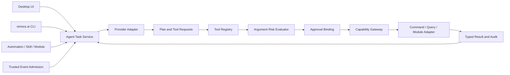

# Nimora AI Agent 与 CLI 架构规范

> 版本：0.1.0-draft  
> 更新日期：2026-07-17  
> 状态：实现基线

## 1. 产品边界

AI 是 Nimora 的可选增强运行时，不是桌宠、自动化、用户代码或本地数据的启动依赖。桌面 UI、`nimora ai` CLI、Automation、Skill 和其它宿主模块共享同一个 Agent Runtime；任何入口都不得建立绕过权限、风险确认或审计的第二条执行路径。

Agent 能力包括对话、计划、工具调用、任务暂停/继续/取消、历史、Provider 切换、Agent Pack、受控记忆和保存为自动化。没有网络、账户、API Key 或可用 Provider 时，非 AI 能力继续工作并返回稳定降级状态。

## 2. 跨模块交互



### 2.1 AI 调用其它模块

- 模块通过 Contribution Manifest 注册 Tool Descriptor，不向 Agent 暴露数据库、内部对象、文件路径或系统句柄。
- Tool 必须声明输入/输出 Schema、基础风险、数据分类、副作用、幂等性、取消支持和超时。
- 实际风险取 Manifest、Capability、底层 Permission、调用参数和当前环境风险的最大值；模型不能降低风险。
- Read-only Safe/Low 工具可按用户策略自动执行；所有写入或外部副作用默认确认，Medium 及以上即使只读也必须确认。
- 用户批准与 `taskId + invocationId + traceId + toolId + risk + arguments` 指纹绑定；参数变化后批准失效。
- 调用最终进入 Capability Gateway，并映射为统一 Command、Query 或专用模块 Adapter；禁止直接调用模块内部函数。

### 2.2 其它模块调用 AI

- Desktop、CLI、Automation、Skill、Module 和受信 Event Admission 均可创建 Agent Task。
- 请求方必须具有 `agent.task.create` Capability，并声明允许的 Provider、Tool allowlist、数据分类、主动性和预算上限。
- 模块可以查询任务摘要、订阅状态、提交用户批准、暂停、继续或取消自己创建的任务；不能读取其它命名空间的 Prompt、记忆或结果正文。
- Event 不能直接成为 Prompt。先经过来源信任、Schema、速率、去重、数据分类和 Prompt Injection 标记，再生成受界定上下文。
- Agent 结果若触发模块动作，仍必须重新进入 Tool Registry 和 Capability Gateway，不能把模型文本当作已授权 Command。

## 3. Tool 契约

当前 Rust 基线位于 `crates/agent-runtime`：

- `nimora.agent-tool/1`：模块工具描述。
- `nimora.agent-tool-invocation/1`：单次具体参数调用。
- `nimora.agent-tool-approval/1`：与调用及风险绑定的批准证明。
- Registry 最多加载 512 个 Tool，单个输入或输出 Schema 最大 64 KiB。
- Tool ID 使用至少三段的小写点分命名，例如 `core.pet.state-read`、`skill.timer.session-start`。
- Tool Backend 只能收到描述、受控参数、Trace 和超时，不获得 Provider 凭据或 Agent 内部记忆。
- `AgentCoordinator` 把模型推进与工具执行拆成独立的确定性单步：Provider 返回的 Tool Call 先转换为新的 `ToolInvocation`，再经过 Registry admission；模型响应不能直接触发 Backend。
- 工具执行单步必须校验 Task/Trace 归属，在真正调用模块 Capability Gateway Backend 前扣减工具预算，并重新验证批准指纹。

## 4. 任务生命周期与预算

```text
pending → planning → running → succeeded | failed | cancelled
                   ↘ waiting-for-confirmation ↗
running → paused → running
任何活动状态 → budget-exhausted
```

每个任务必须同时限制：

- 最大计划/Provider 步骤数。
- 最大 Tool 调用数。
- 最大墙钟时间，使用饱和时间差处理系统时钟回退。
- 最大输入和输出 Token。
- 最大费用微单位；本地免费 Provider 仍记录 `0`，不能跳过其它预算。
- 最大并发、上下文字节、单次响应字节和历史保留期由宿主策略补充。

任务元数据不保存 Prompt 正文，只记录稳定 ID、来源、请求方、Provider、状态、预算、用量与时间。Prompt、附件、记忆和 Tool 结果按独立数据分类与生命周期存储。

## 5. Provider Adapter

当前 `nimora.agent-provider/1` Rust 契约已覆盖能力集合发现、本地/网络属性、结构化 Tool Call、取消、Token 用量、费用、上下文窗口、有界请求响应和稳定错误分类。能力使用可扩展集合而非固定布尔字段，新增 Provider 能力不要求破坏描述结构。流式事件协议和真实网络 Adapter 尚未实现。首批适配目标：

- OpenAI-compatible HTTPS Provider。
- Ollama 与其它显式配置的本地回环 Provider。
- 测试用确定性 Mock、超时、畸形响应和 Prompt Injection Provider。

Provider 只能看到任务授权的数据视图，不接触 Secure Store。凭据由宿主按 Provider ID 注入请求 Adapter；错误返回稳定类别，不把 Key、完整请求或底层网络细节写入 UI 和诊断包。

运行时当前强制：最多 64 个 Adapter、256 条消息、256 KiB 消息正文、1 MiB 响应正文、32 个 Tool Call 和 10 分钟单次超时；离线模式在调用 Adapter 前拒绝网络 Provider。Provider 返回的未知 Tool、非对象参数、错配 Request ID、超出输出预算或不一致 Finish Reason 全部 fail-closed。

## 6. CLI

正式 CLI 名称为 `nimora`，AI 子命令必须与桌面使用同一运行时和数据目录锁协议：

```text
nimora ai chat
nimora ai run --input task.json --output json
nimora ai task list|show|cancel|resume
nimora ai provider list|probe
nimora ai tool list|describe
nimora ai history export|delete
```

当前首个可运行 CLI 基线位于 `apps/cli`，已实现 `provider list|probe`、`tool list|describe` 与非交互 `run`。内置 `provider:deterministic-local` 是无网络、无凭据、零费用的确定性诊断 Provider，用于证明 CLI、任务状态、预算、Provider Registry 和离线策略的真实端到端路径；它不是通用语言模型，也不代表 OpenAI-compatible 或 Ollama 已接通。

- 交互终端显示计划、实际 Tool 参数、风险、Provider 数据预览和实时预算。
- 非交互模式遇到需确认操作必须退出并返回结构化 `confirmation-required`，禁止默认同意。
- `--yes` 只能覆盖明确允许自动批准的 Safe read-only Tool，不能覆盖写入、外部副作用或 Medium 以上风险。
- `--offline` 禁止网络 Provider，并只选择已验证本地 Provider。
- JSON 输出保持 stdout 机器可读，进度和诊断写 stderr；退出码稳定且有文档。
- `run` 输入文件或 stdin 最大 256 KiB，拒绝未知字段；当前稳定退出码为 `2` 用法错误、`3` 输入错误、`4` 资源不存在、`5` 需要确认、`10` 运行时错误。

## 7. 安全不变量

- System Policy、用户权限、Tool allowlist 和预算不进入模型可修改上下文。
- 外部网页、文件、Connector、Tool 输出和模型文本均标记为不可信数据，不得改变策略层指令。
- Safe Mode 在 2 秒内取消 Agent Worker、撤销工具执行租约并阻止新任务；高风险能力不会自动恢复。
- Tool 结果必须按输出 Schema 和大小预算校验；未知字段、超限、非有限数字和协议错序均拒绝。
- 重试有副作用 Tool 必须具备幂等键或补偿策略；未知执行结果不能自动重放。
- Agent 记忆支持查看、编辑、删除、禁用和按 Profile 隔离；删除后不得继续出现在上下文、导出或索引中。

## 8. 完成标准

完整实现至少证明：桌面与 CLI 任务等价、多 Provider 可替换、本地离线运行、模块双向调用、实际参数风险确认、批准失效、预算终止、Prompt Injection 防护、Safe Mode 强停、历史与记忆删除、Provider 数据预览、故障恢复、跨平台桌面验证和真实 UI 截图。
