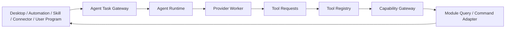

# Nimora AI 模块双向交互规范

> 版本：0.1.0-draft  
> 更新日期：2026-07-18  
> 状态：开发约束与实施蓝图

## 1. 目的

本文定义 AI Runtime 与 Nimora 其它模块之间的双向调用方式。AI 不是拥有全局权限的中枢，而是可被模块调用、也可通过受控工具调用模块的普通运行时。所有交互必须可授权、可取消、可审计、可降级、可测试，并在离线或 Provider 不可用时保持非 AI 功能正常运行。

## 2. 唯一双向通路

调用规则：

1. 模块调用 AI，只能创建受约束的 `AgentTaskRequest`，不能直接调用 Provider。
2. AI 调用模块，只能选择 Tool Registry 中已注册的工具，不能生成任意 Command 名称。
3. Tool Adapter 只能调用 Capability Gateway，不能持有 Repository、数据库连接、窗口句柄或 Provider 密钥。
4. Agent 输出是数据，不是授权。输出要产生副作用时必须形成新的 Tool Invocation 并重新授权。
5. 双向调用共享 Trace，但 Trace ID 不是权限凭证；权限由调用方身份、Capability、预算和批准证明共同决定。

## 3. 模块调用 AI 契约

统一请求采用 `nimora.agent-task-request/1`，至少包含：

| 字段 | 含义 |
| --- | --- |
| `requester` | `desktop`、`automation:<id>`、`skill:<id>`、`connector:<id>` 或 `program:<id>` |
| `purpose` | 面向用户展示的任务目的，不允许隐藏目的 |
| `input` | 已分类、已裁剪的结构化上下文 |
| `providerPolicy` | Local-only、允许的 Provider 与模型限制 |
| `toolAllowlist` | 本任务可见的最小工具集合 |
| `dataPolicy` | 数据分类、是否允许离开设备、保留策略 |
| `autonomy` | 建议、草拟、需确认执行或预授权执行 |
| `budget` | Token、Tool 次数、墙钟时间、重试和费用上限 |
| `resultSchema` | 调用方期望的结构化结果 Schema |
| `parentTraceId` | 上游 Trace，用于审计而非授权 |

调用方必须具有 `agent.task.create`；创建后只获得 `AgentTaskHandle`。Handle 允许查看状态摘要、取消任务、提交属于该任务的批准及读取符合 `resultSchema` 的结果，不能读取 Provider 凭据、系统 Prompt、其它任务记忆或其它模块正文。

### 3.1 主动性等级

| 等级 | 行为 |
| --- | --- |
| `suggest` | 只返回建议，不允许工具写操作 |
| `draft` | 可读取和生成草案，不提交模块状态 |
| `confirm-each` | 每个副作用调用均绑定一次用户批准 |
| `approved-plan` | 用户批准固定计划后执行，参数或顺序变化即失效 |
| `policy-bound` | 仅限用户显式创建的窄规则，在预算和时间窗内自动执行 |

不得提供“始终允许 AI 操作所有模块”的全局开关。

## 4. AI 调用模块契约

模块通过 Contribution Manifest 注册 Tool Descriptor。Descriptor 除输入输出 Schema 外，必须声明：

- Capability、数据分类和最小调用方信任级别。
- `read-only`、`reversible-write` 或 `external-side-effect`。
- 幂等键语义、取消点、超时、重试安全性和补偿能力。
- Safe Mode、Recovery Mode、离线状态和锁屏状态下的行为。
- 输出裁剪策略与敏感字段清单。
- 版本、弃用期和兼容范围。

工具执行顺序固定为：Schema 校验 → 参数风险提升 → Task/Trace 归属 → Capability → 预算扣减 → 批准指纹 → Safe Mode → Backend → 结果裁剪 → 审计。任一步失败都不能调用后续 Backend。

## 5. 双向能力矩阵

| 模块 | 向 AI 提供的受控工具 | 调用 AI 的典型任务 | 关键边界 | 当前实现 |
| --- | --- | --- | --- | --- |
| Pet Runtime | 读状态、读动作目录、播放动作、移动 | 生成互动意图、选择合适动作 | AI 不控制逐帧动画和渲染循环 | 已有生产工具 |
| Profile | 读场景、切换已有场景 | 根据用户目标推荐场景 | 不允许 AI 修改全局安全模式 | 已有生产工具 |
| Character / Asset | 读脱敏目录、切换已验证角色 | 推荐角色、生成导入说明 | 不暴露模型路径；导入与下载另行确认 | 已有生产工具的一部分 |
| User Program | 读完整性通过的目录、执行精确版本 | 解释程序结果、辅助编写代码 | AI 不读取源码或继承程序权限 | 已有生产工具的一部分 |
| Automation | Dry-run 验证、未来保存/启停/运行 | 自然语言生成规则、解释失败 | Event 不直接成为 Prompt；保存前再次验证 | 仅验证工具已实现 |
| Skill | Skill Tool Contribution | 摘要、分类、内容生成等任务 | 每个 Skill 独立命名空间和配额 | 未实现 Host |
| Connector | 读连接状态、受控发送/查询 | 对外部内容摘要、分类、回复草拟 | 外部内容始终标记不可信；防 Prompt Injection | 未实现 Runtime |
| Notification | 查询通道、发送通知 | 生成提醒文案和优先级 | 通知频率、安静时段和隐私预览受策略控制 | 未实现模块工具 |
| Calendar / Tasks | 查询授权范围、创建草案/事件 | 日程规划、冲突解释 | 默认草案；写入和邀请参与者分别批准 | 未实现模块 |
| Clipboard / Selection | 一次性读取选区、写入草稿 | 改写、翻译、代码解释 | 不允许后台持续读取；敏感检测后升级风险 | 未实现模块 |
| Files / Knowledge | 搜索授权集合、读片段、写草案 | 本地知识问答和内容生成 | 路径授权、符号链接防护、引用来源、无任意遍历 | 未实现模块 |
| Screen / Vision | 用户触发截图、区域 OCR | 界面解释和辅助操作 | 明示录制指示、敏感窗口排除、短保留 | 未实现模块 |
| Diagnostics | 读脱敏健康摘要 | 故障解释和修复建议 | 不读取自由日志、密钥、路径和用户正文 | 已有只读工具 |
| Memory | 查询/提议写入受控记忆 | 个性化与长期偏好 | 写入前展示、来源与过期时间；可导出删除 | 未实现 |

所有“未实现”项都属于产品范围，优先级只决定施工顺序，不代表推迟到不确定版本。

## 6. 关键组合闭环

### 6.1 AI 生成自动化

自然语言 → 结构化规则草案 → `automation.definition.validate` Dry-run → 展示触发条件、动作、权限和模拟结果 → 用户批准保存 → Automation Repository → 后续真实事件触发时重新经过 Action Capability Gateway。Agent 创建规则时的批准不能替代规则未来运行所需的授权。

### 6.2 自动化调用 AI

可信 Event Admission → 字段分类与注入扫描 → 模板生成受界定上下文 → 创建 `AgentTaskRequest` → 获取结构化结果 → Condition 校验 → 需要动作时进入 Automation Action Gateway。必须设置每规则并发、冷却时间、每日次数、Token 和费用预算。

当前 `crates/automation-agent-bridge` 已实现独立 Adapter：只拦截固定 `agent.task.run` Command，其余动作继续进入原 Automation Backend；Automation Engine 为每次 Backend 调用提供不可由规则覆盖的 `run_id/automation_id/action_id/event_id/trace_id` 执行上下文，重试与补偿保持同一 Run 因果链。AI 动作要求 Medium 以上风险、幂等键、受信静态 instruction、显式 Provider、模型、Tool Allowlist、Data、Autonomy 和预算，并通过 `AgentTaskGateway` 创建以 Automation Run 为根、继承 Trace 和根剩余预算的子任务。准入时钟与根剩余预算由宿主 `AutomationAgentContext` 提供，不接受规则作者声明；规则尝试注入 `nowMs` 或 `rootRemainingBudget` 会被严格参数反序列化拒绝。标记为 `untrusted` 的动态上下文在专用 Context Admission 落地前 fail-closed。

桌面 Live Automation 已组合 `AutomationAgentBridge<AutomationCapabilityBridge<DesktopCapabilityBackend>, DesktopAutomationAgentSubmitter, DesktopAutomationAgentContext>`。提交器复用桌面 `ProviderRegistry`、`AgentCoordinator`、Tool Registry、Capability Gateway、确认队列和历史仓储；任务级 Tool Allowlist 贯穿 Provider 首轮、等待确认和批准后续跑，Provider 请求越权工具会在登记确认或模块副作用前拒绝。根 Automation Run ID 与幂等键共同去重同一次运行的重试提交。同步完成结果写入 Agent History；等待用户确认的任务进入既有确认队列。持久异步结果回填、跨重启提交去重和取消传播仍需继续实现。

桌面共享数据库现已提供版本化 Automation Run Journal：宿主可在副作用前写入 `running`，终态原子绑定完整 `AutomationRun`，重复完成和身份错配均拒绝；桌面启动会把上次进程遗留的 `running` 标记为 `interrupted`，原生 IPC 与 TypeScript 平台契约可按稳定 `runId` 查询。该 Journal 是 Live 执行、异步 Agent 结果回填、取消与重启恢复的持久基础，不等同于生产 Live Backend 已完成。

### 6.3 用户代码与 AI

用户程序只能通过 SDK 创建 AI 任务或调用 Manifest 明确声明的 Agent 工具。程序权限与 Agent 权限不合并：程序发起任务时取“程序声明、用户授权、Agent Policy”三者交集；Agent 执行程序时绑定程序 ID、版本、入口、参数和批准指纹。双方不能借对方完成权限提升。

### 6.4 Connector 与 AI

外部消息进入后先保存原始来源元数据，再做 Schema、大小、速率、去重、恶意内容与 Prompt Injection 标记。只有被策略允许的字段进入 Agent 上下文。Agent 生成的外发内容先成为草稿，发送动作由 Connector Tool 单独授权和审计。

## 7. 防递归与防失控

- Task 记录 `rootTaskId`、`parentTaskId`、`callDepth` 和已访问模块链；默认最大深度 4。
- Agent Tool 触发 Automation、Automation 再创建 Agent Task 时继承同一根预算，不能重置额度。
- 相同 `rootTaskId + toolId + canonicalArguments` 在时间窗内使用幂等键去重。
- 禁止 Provider、Skill、Automation 或 Connector自行扩大 Tool allowlist。
- 达到循环、预算、超时、并发或外部费用阈值时 fail-closed，并返回可解释终止原因。
- 用户取消根任务时，级联取消子任务、Worker、待批准调用和可取消 Backend；已提交副作用进入补偿或明确的部分完成状态。

## 8. 数据与隐私

- Context Builder 默认最小化字段，敏感字段使用明确 allowlist，而不是事后黑名单。
- Remote Provider 前执行数据出境决策；不满足策略时自动选择本地 Provider或拒绝，不静默降级到远程。
- Tool Result 进入 Provider 前再次裁剪，避免模块 Backend 无意返回路径、Token、用户正文或内部 ID。
- 记忆写入是独立 Capability；普通对话历史不自动成为长期记忆。
- 审计保存元数据、风险、批准和结果摘要，不默认保存完整 Prompt、截图、文件正文和模型响应。

## 9. 稳定性与离线行为

- Provider Worker 崩溃只终止关联任务，不影响 Pet、Automation、Profile 和用户代码 Host。
- 无网络时本地 Provider 可继续工作；没有本地 Provider 时返回 `providerUnavailable`，不得阻塞非 AI 流程。
- Tool Backend 超时与 Provider 超时独立；两者均受根任务 Deadline 约束。
- Agent Task、待批准项和确定性计划需要持久恢复；恢复后已过期批准必须失效。
- Recovery Mode 禁止远程 Provider、写工具和外部副作用，只允许明确的脱敏诊断读取。

## 10. 测试门禁

每个新增双向交互至少覆盖：

1. 正常调用、Schema 拒绝、Capability 拒绝、参数风险提升和批准失效。
2. Safe/Recovery Mode、离线、Provider 崩溃、Backend 超时和用户取消。
3. Prompt Injection 输入不能修改系统约束、Tool allowlist 或批准状态。
4. Tool Result 不泄露路径、密钥、内部对象、未授权正文和其它命名空间数据。
5. 重试不重复非幂等副作用，递归链共享预算并在深度上限终止。
6. 模块调用 AI 失败不破坏模块原事务；AI 调用模块失败不伪造成功 Event。
7. Desktop、CLI、Automation 和 SDK 入口使用同一策略与结果契约。

## 11. 当前代码审计结论

- `crates/agent-runtime` 已具备任务、预算、Provider 单步推进、Tool admission 和批准绑定。
- `crates/agent-tools` 已提供十三项固定生产工具，形成 Pet、Profile、Character、Asset、Program、Diagnostics 和 Automation Validation 到 Capability Gateway 的真实链路。
- `crates/user-code-gateway` 已让 Agent 与用户程序复用 Backend，但使用彼此独立的 Policy，避免权限继承。
- `apps/desktop/src-tauri` 已接通 Desktop 与 CLI 的 Agent 入口、Ollama Worker、待批准续跑和历史持久化。
- `crates/agent-runtime` 已实现宿主无关的 `AgentTaskGateway` 准入核心：精确调用方、来源、Provider、Tool allowlist、数据等级、主动性、最大深度与预算上限全部 fail-closed；子任务继承 Trace，并取请求、调用方策略和父任务剩余预算的交集，不能通过递归重置额度。
- Desktop 对话、Desktop 独立 Tool 准备入口和 CLI 非交互任务均已迁移到 `AgentTaskGateway`；其 Provider 与 Tool 集合从当前生产目录生成，入口不能通过自定义请求扩大策略。Automation、Skill、Connector 和 User Program 尚无生产入口，因此模块反向调用仍未全部贯通。
- Tool Registry 当前仍是内建目录，尚未接入 Extension Contribution Manifest；新增模块不得直接把工具硬编码进 Provider Adapter。

## 12. 实施顺序

1. 在 Gateway 外层接入调用方 Capability、结果 Schema、持久 Task Tree 和共享根预算账本。
2. 为已接入桌面 Agent Service 的 Automation 子任务增加持久异步结果回填、取消传播、跨重启幂等、并发、冷却和费用门禁。
3. 实现 Context Admission 与 Prompt Injection 检测，使经字段 allowlist 的不可信事件内容可受控进入任务。
4. 将后续 Skill、Connector 和 User Program 任务创建接入同一 Gateway。
4. 扩展 Automation 保存/启停/运行工具，形成“AI 生成并安全保存规则”闭环。
5. 接入 Skill 与 Connector Contribution Manifest，动态汇入 Tool Registry。
6. 增加 Files、Clipboard、Notification、Calendar、Memory 和 Vision 的窄能力 Adapter。
7. 完成任务持久恢复、递归检测、全链路审计与跨平台故障测试。
