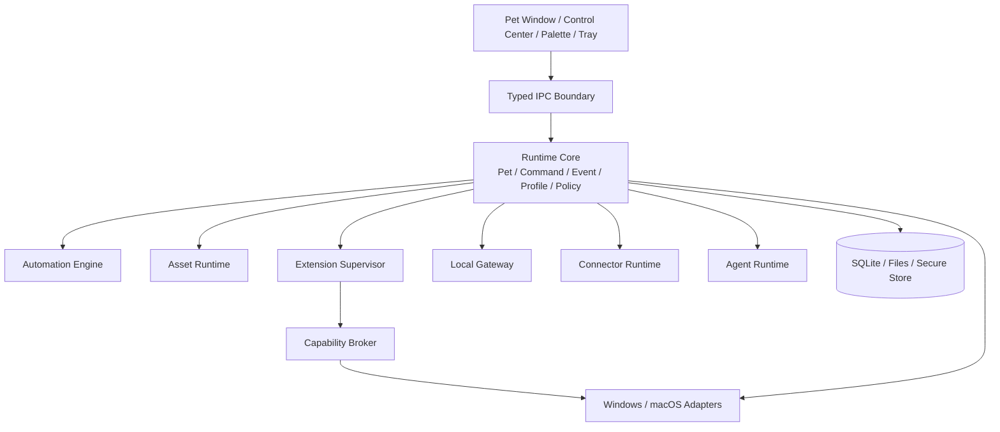

# Nimora 系统架构

> 版本：0.1.0-draft  
> 更新日期：2026-07-17  
> 状态：开发基线

## 1. 架构目标

- 保证桌宠窗口和核心互动始终可用。
- 允许资源、功能、协议和 AI Provider 独立扩展。
- 将不可信代码与 Core 隔离，并通过能力代理访问系统。
- 保持公开契约与语言无关，避免生态绑定内部实现。
- 允许 Windows 与 macOS 使用不同平台适配，但共享领域语义。

## 2. 总体结构



## 3. 进程模型

| 进程 | 职责 | 故障策略 |
|---|---|---|
| Desktop/Core | 窗口、领域状态、策略、持久化、IPC | 必须保持存活；进入降级模式 |
| WebView UI | 渲染与配置界面 | 可重载，不持有唯一业务状态 |
| Extension Host | 运行可信或受限 TS 扩展 | 崩溃后限次重启并可禁用 |
| High-risk Worker | 单个高风险扩展或原生适配器 | 独立生命周期和更严格配额 |
| Model Importer Worker | 单次探测暂存区内的不可信模型 | 超时强杀；崩溃或拒绝不影响 Core |
| Agent Worker | Provider 请求、计划和工具循环 | 超时终止，不直接访问 OS |

独立进程只提供崩溃隔离，不等于安全沙箱。所有敏感能力必须经过 Capability Broker。

## 4. 模块边界

### 4.1 Runtime Core

Core 包含纯领域逻辑：Pet、Command、Event、Profile、Policy、Permission、Package Identity。Core 不依赖 Tauri、PixiJS、HTTP 框架或具体数据库驱动。

### 4.2 Platform Adapters

平台适配实现窗口、托盘、全局热键、通知、Secure Store、前台应用和系统空闲时间。适配器只能实现 Core 定义的 Port。

### 4.3 Asset Runtime

负责资源解析、继承合并、兼容检查、纹理缓存、动画图和回退。资源包不能执行代码。

第三方模型必须经过隔离 Importer 探测、校验和规范化，再交给版本化 Renderer Adapter。Pet Runtime 只依赖统一动作与表达语义，不直接依赖 Live2D、VRM 或 glTF 私有结构。

当前首个 Importer 实现是 `nimora-model-importer-worker`：仅探测 GLB 2.0，桌面宿主先把绝对普通源文件复制为一次性暂存目录内的固定文件名，再以清空环境、关闭 stdin、固定工作目录的一次性子进程运行，限制 80 MiB 输入、1 MiB JSON、64 KiB 协议输出、执行截止时间以及节点、网格、材质和纹理数量。Worker 拒绝外部 URI、data URI、路径逃逸、错误 chunk 顺序和长度不一致，宿主在所有返回路径清理暂存目录且不向 WebView 暴露路径。安装确认会对新暂存副本重新探测，再由宿主生成固定 `models/character.glb`、`nimora.asset/1` Manifest 和 SHA-256 inventory，通过 Asset Installer 原子激活；本地生成身份限制在 `character.local.*`。Pet Overlay 的首个真实 3D Adapter 使用 Three.js `WebGLRenderer` 与 `GLTFLoader`，只能从宿主签发的 Renderer Descriptor 构造 Pet 专用资源 URL；宿主每次读取都复验包并仅返回唯一 `entrypoints.model`。Adapter 自动计算包围盒、居中取景、播放首动画回退，并在卸载或 GPU context 丢失时停止动画、释放几何体、材质、纹理与 WebGL context。该实现仍不代表 Renderer 独立进程或 OS/GPU 沙箱，也未完成网格/纹理重写、许可证扫描、标准动作语义、GLTF JSON、VRM 或 Live2D 支持。

### 4.4 Extension Supervisor

负责安装状态、进程监督、激活事件、配额、心跳、升级、回滚和崩溃处理。扩展只能通过版本化 Host API 通信。

### 4.5 Capability Broker

统一执行文件、网络、通知、剪贴板、应用启动等敏感操作。Broker 校验扩展身份、Capability、Permission、目标策略、用户授权和调用参数，并写入审计。

### 4.6 Event 与 Command

- Event 表示已经发生的事实，不用于请求执行。
- Command 表示有意图的操作，返回结构化结果。
- Query 读取状态，不产生隐式副作用。
- Agent Tool、Automation Action 和 Gateway Endpoint 最终都映射到 Command。

当前 M0 运行时在状态变更前生成领域 Event，事件与发起 Command 共享 `traceId`。当前唯一 SQLite Schema 将宠物或 Profile 快照及对应 Event 在同一事务中写入 `event_outbox`，任一写入失败则整体回滚；事务成功后，事件再进入容量为 256 的有界进程内缓冲区并通过类型化桌面 IPC 消费。该缓冲区满时淘汰最旧事件，只负责进程内即时 UI。持久 Outbox 提供有界有序领取、消费者租约、过期重领、所有权 ACK、延迟重试、最大尝试次数死信、健康计数和有界已确认清理；领取使用 SQLite Immediate 事务防止并发消费者重复占有同一记录。具体 Connector 仍需实现幂等投递与退避策略，因此当前只能证明可构建 at-least-once 消费，不宣称 exactly-once 或已有外部投递服务。

这条规则防止四套执行逻辑分裂。

## 5. 数据与持久化

| 数据 | 存储 | 策略 |
|---|---|---|
| 设置/Profile | SQLite 或版本化文档 | 事务迁移、自动备份 |
| 宠物状态/关系 | SQLite | 定期快照，事件不作为唯一事实 |
| 资源包 | 内容寻址文件仓库 | hash 校验、原子切换 |
| 扩展配置 | 扩展命名空间 | 配额、Schema、迁移 |
| 密钥 | OS Secure Store | 配置仅保存引用 |
| 审计 | 轮转 JSONL 或 SQLite | 保留期和导出可配置 |
| 临时缓存 | Cache 目录 | 可安全删除和重建 |

当前宠物与 Profile 状态实现遵循 `runtime-core → runtime-app → persistence-sqlite` 依赖方向：领域层定义状态与不变量，应用层通过 `PetRepository`、`ProfileRepository` 端口组织用例，SQLite 适配器负责事务、版本校验、持久 Outbox 和 Online Backup API。状态与对应 Event 原子提交后才发布到内存与共享事件缓冲区，具体决策见 [`adr/ADR-008-versioned-sqlite-snapshots.md`](adr/ADR-008-versioned-sqlite-snapshots.md)。尚未发布的数据库采用唯一首版 Schema，一次事务创建宠物快照、Profile 快照、事务 Outbox 和用户程序权限表，不保留开发期中间迁移；测试覆盖初始化、未知版本拒绝、事件载荷反序列化、重复事件 ID 整体回滚、租约/ACK/重试/死信/清理，以及 WAL 状态在线备份恢复。真实版本升级前的备份调度、具体 Outbox 消费者和只读安全模式仍是后续工作。

Profile 激活属于“持久状态 + 原生窗口副作用”的复合操作。桌面适配器先应用候选窗口策略，再提交 Profile 快照；持久化失败时恢复原窗口策略。安全模式使用独立应用服务和共享事件总线，桌面菜单、IPC 和后续 Gateway、Connector、Agent Host 必须读取同一状态，不得维护各自的安全开关。

Profile 具有严格且可扩展的场景类型：`companion`、`work`、`focus`、`creator`、`developer`、`presentation` 与 `offline`。类型表达用户意图并为导航、动效、通知和资源预算提供默认值，但不是 Capability 黑名单；实际文件、网络、代码和模块访问仍由独立权限网关判断。用户可继续覆盖窗口、声音和主动频率，未来临时授权及自动切换规则也必须叠加在 Profile 之上，而不能由 `work` 等标签永久删减功能。只有独立的全局安全模式可以强制终止高风险能力。场景类型是当前契约的必填字段，未知值必须拒绝，避免隐式降级。

原生窗口移动事件不得逐帧写入 SQLite。桌面适配器使用单调递增 revision 对连续移动进行 200ms trailing-edge 合并，仅在窗口稳定后读取最终原生坐标并持久化；相同坐标不产生重复 Command/Event。托盘退出会在进程终止前同步刷新最终位置，兼顾拖拽流畅度、SSD 写放大控制和落点恢复可靠性。

托盘不是绕过应用层的特权入口。打开控制中心和恢复宠物交互在原生副作用成功后分别发布 `desktop.window.control-center-opened` 与 `pet.window.interaction-restored`；失败发布 `desktop.tray.action-failed` 诊断事件。恢复交互必须先显示窗口并关闭原生鼠标穿透，再提交内存窗口策略，不能仅修改 UI 或缓存状态。

Pet 交互状态转换由 Core 定义，而不是由 React 动画反推。点击进入 `interacting` 并发布 `pet.interaction.clicked`，600ms 后仅在状态仍未被新操作替换时回到 `idle`；拖拽进入最高优先级 `dragged`，原生拖拽结束后以一次持久化更新最终位置并回到 `idle`，发布 `pet.window.drag.started` 与 `pet.window.dragged`。Command 与对应 Event 共享 Trace ID，失败不得留下假事件。

`dragged`、`interacting`、`recovering` 属于不可跨进程延续的瞬态。运行时加载持久快照时会将这些状态归一化为 neutral idle，并在对外提供状态前重新持久化；恢复写入失败则启动失败，不允许以内存状态掩盖磁盘不一致。

## 6. 事件契约修正

事件 `source` 必须支持以下命名空间：

```text
core
skill:<package-id>
automation:<rule-id>
agent:<agent-id>
connector:<connector-id>
gateway:<client-id>
system:<adapter-id>
```

Source Connector 导入的外部事件先验证、规范化并分配新的本地 `id`；原始标识保存在 `data.externalId`。Sink 重试使用同一事件 `id` 和独立 `deliveryId`，避免混淆事件幂等与投递尝试。

## 7. 连接器分类

| 类型 | 方向 | 示例 |
|---|---|---|
| Source | 外部 → Event Bus | SSE Client、MQTT Subscribe |
| Sink | Event Bus → 外部 | HTTP Webhook、UDP、MQTT Publish |
| Duplex | 双向 | WebSocket、NATS |
| Gateway | 外部客户端调用本地能力 | REST、WS Server、SSE Server |

监听地址使用 `listenAddress`；远程目标使用 `destination`；本地网卡选择使用 `localBindAddress`。三个概念不得复用同一字段。

## 8. 扩展点

- `commands`
- `automation.triggers`
- `automation.conditions`
- `automation.actions`
- `agent.tools`
- `pet.behaviorModifiers`
- `pet.interactions`
- `ui.menuItems`
- `ui.settingsPanels`
- `ui.widgets`
- `connectors.providers`
- `assets.resolvers`

公开扩展点必须拥有 Schema、风险等级、生命周期和兼容策略。

用户脚本是正式扩展点：运行于独立受配额 Host，只能调用 SDK 注入 API。它与 Skill、Automation、Agent Tool 共用 Command Registry 和 Capability Broker，不允许直接访问 Node 敏感内建模块。

## 9. 失败与降级

- 资源失败：回退官方默认角色并报告资源诊断。
- UI 失败：重载 WebView，Core 状态不丢失。
- 扩展失败：停止扩展，撤销注册项，核心继续运行。
- 数据库迁移失败：恢复备份并以只读安全模式启动。
- Agent 失败：终止任务，保留命令和规则功能。
- 网络失败：连接器熔断，不阻塞 Event Bus。
- 事件风暴：按来源配额、背压和丢弃策略隔离。

## 10. 依赖规则

```text
UI / Adapters / Extension Hosts
          ↓
Application Services
          ↓
Domain Core
```

- Domain Core 不导入外层框架。
- 模块通过公开接口和 Schema 通信，禁止访问其他模块内部文件。
- 网络发送、系统调用和密钥读取必须经过统一端口。
- 禁止创建无边界的 `common` 或 `utils` 包。
