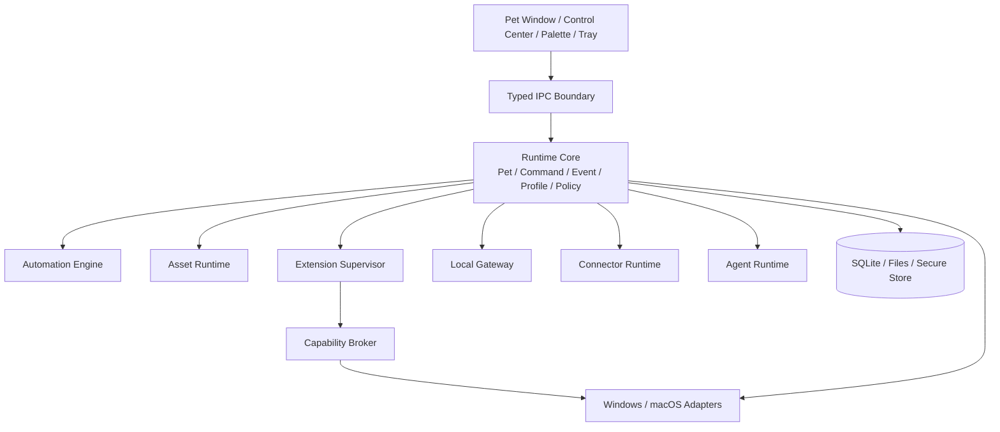

# DeskPet 系统架构

> 版本：0.1.0-draft  
> 更新日期：2026-07-17  
> 状态：开发基线

## 1. 架构目标

- 保证桌宠窗口和核心互动始终可用。
- 允许资源、功能、协议和 AI Provider 独立扩展。
- 将不可信代码与 Core 隔离，并通过能力代理访问系统。
- 保持公开契约与语言无关，避免生态绑定内部实现。
- 允许 Windows 与 macOS 使用不同平台适配，但共享领域语义。

## 2. 总体结构



## 3. 进程模型

| 进程 | 职责 | 故障策略 |
|---|---|---|
| Desktop/Core | 窗口、领域状态、策略、持久化、IPC | 必须保持存活；进入降级模式 |
| WebView UI | 渲染与配置界面 | 可重载，不持有唯一业务状态 |
| Extension Host | 运行可信或受限 TS 扩展 | 崩溃后限次重启并可禁用 |
| High-risk Worker | 单个高风险扩展或原生适配器 | 独立生命周期和更严格配额 |
| Agent Worker | Provider 请求、计划和工具循环 | 超时终止，不直接访问 OS |

独立进程只提供崩溃隔离，不等于安全沙箱。所有敏感能力必须经过 Capability Broker。

## 4. 模块边界

### 4.1 Runtime Core

Core 包含纯领域逻辑：Pet、Command、Event、Profile、Policy、Permission、Package Identity。Core 不依赖 Tauri、PixiJS、HTTP 框架或具体数据库驱动。

### 4.2 Platform Adapters

平台适配实现窗口、托盘、全局热键、通知、Secure Store、前台应用和系统空闲时间。适配器只能实现 Core 定义的 Port。

### 4.3 Asset Runtime

负责资源解析、继承合并、兼容检查、纹理缓存、动画图和回退。资源包不能执行代码。

第三方模型必须经过隔离 Importer 探测、校验和规范化，再交给版本化 Renderer Adapter。Pet Runtime 只依赖统一动作与表达语义，不直接依赖 Live2D、VRM 或 glTF 私有结构。

### 4.4 Extension Supervisor

负责安装状态、进程监督、激活事件、配额、心跳、升级、回滚和崩溃处理。扩展只能通过版本化 Host API 通信。

### 4.5 Capability Broker

统一执行文件、网络、通知、剪贴板、应用启动等敏感操作。Broker 校验扩展身份、Capability、Permission、目标策略、用户授权和调用参数，并写入审计。

### 4.6 Event 与 Command

- Event 表示已经发生的事实，不用于请求执行。
- Command 表示有意图的操作，返回结构化结果。
- Query 读取状态，不产生隐式副作用。
- Agent Tool、Automation Action 和 Gateway Endpoint 最终都映射到 Command。

这条规则防止四套执行逻辑分裂。

## 5. 数据与持久化

| 数据 | 存储 | 策略 |
|---|---|---|
| 设置/Profile | SQLite 或版本化文档 | 事务迁移、自动备份 |
| 宠物状态/关系 | SQLite | 定期快照，事件不作为唯一事实 |
| 资源包 | 内容寻址文件仓库 | hash 校验、原子切换 |
| 扩展配置 | 扩展命名空间 | 配额、Schema、迁移 |
| 密钥 | OS Secure Store | 配置仅保存引用 |
| 审计 | 轮转 JSONL 或 SQLite | 保留期和导出可配置 |
| 临时缓存 | Cache 目录 | 可安全删除和重建 |

当前宠物状态实现遵循 `runtime-core → runtime-app → persistence-sqlite` 依赖方向：领域层定义状态与不变量，应用层通过 `PetRepository` 端口组织用例，SQLite 适配器负责事务和版本校验。状态写入成功后才发布到内存，具体决策见 [`adr/ADR-008-versioned-sqlite-snapshots.md`](adr/ADR-008-versioned-sqlite-snapshots.md)。初始数据库版本不包含破坏性迁移；自动备份、迁移失败回滚和只读安全模式必须在首个升级迁移前完成。

## 6. 事件契约修正

事件 `source` 必须支持以下命名空间：

```text
core
skill:<package-id>
automation:<rule-id>
agent:<agent-id>
connector:<connector-id>
gateway:<client-id>
system:<adapter-id>
```

Source Connector 导入的外部事件先验证、规范化并分配新的本地 `id`；原始标识保存在 `data.externalId`。Sink 重试使用同一事件 `id` 和独立 `deliveryId`，避免混淆事件幂等与投递尝试。

## 7. 连接器分类

| 类型 | 方向 | 示例 |
|---|---|---|
| Source | 外部 → Event Bus | SSE Client、MQTT Subscribe |
| Sink | Event Bus → 外部 | HTTP Webhook、UDP、MQTT Publish |
| Duplex | 双向 | WebSocket、NATS |
| Gateway | 外部客户端调用本地能力 | REST、WS Server、SSE Server |

监听地址使用 `listenAddress`；远程目标使用 `destination`；本地网卡选择使用 `localBindAddress`。三个概念不得复用同一字段。

## 8. 扩展点

- `commands`
- `automation.triggers`
- `automation.conditions`
- `automation.actions`
- `agent.tools`
- `pet.behaviorModifiers`
- `pet.interactions`
- `ui.menuItems`
- `ui.settingsPanels`
- `ui.widgets`
- `connectors.providers`
- `assets.resolvers`

公开扩展点必须拥有 Schema、风险等级、生命周期和兼容策略。

用户脚本是正式扩展点：运行于独立受配额 Host，只能调用 SDK 注入 API。它与 Skill、Automation、Agent Tool 共用 Command Registry 和 Capability Broker，不允许直接访问 Node 敏感内建模块。

## 9. 失败与降级

- 资源失败：回退官方默认角色并报告资源诊断。
- UI 失败：重载 WebView，Core 状态不丢失。
- 扩展失败：停止扩展，撤销注册项，核心继续运行。
- 数据库迁移失败：恢复备份并以只读安全模式启动。
- Agent 失败：终止任务，保留命令和规则功能。
- 网络失败：连接器熔断，不阻塞 Event Bus。
- 事件风暴：按来源配额、背压和丢弃策略隔离。

## 10. 依赖规则

```text
UI / Adapters / Extension Hosts
          ↓
Application Services
          ↓
Domain Core
```

- Domain Core 不导入外层框架。
- 模块通过公开接口和 Schema 通信，禁止访问其他模块内部文件。
- 网络发送、系统调用和密钥读取必须经过统一端口。
- 禁止创建无边界的 `common` 或 `utils` 包。
